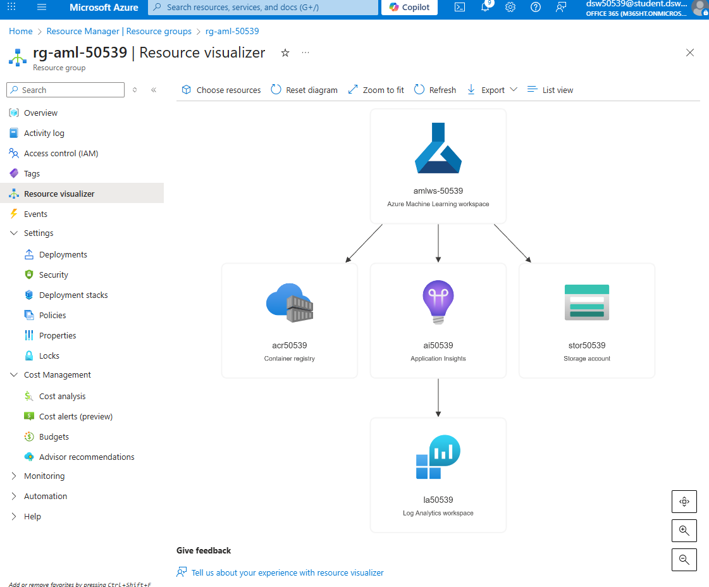

# Terraform Lab – Azure Machine Learning

Ten folder zawiera kod Terraform, który tworzy środowisko Azure Machine Learning Workspace  
wraz ze wszystkimi zależnościami (Storage, Key Vault, Log Analytics, Application Insights, ACR)  
w regionie France Central.  
Wszystkie nazwy zasobów zawierają numer indeksu studenta.

## Utworzone zasoby
- Storage Account (dla AML)  
- Key Vault  
- Log Analytics Workspace  
- Application Insights  
- Container Registry  
- AML Workspace  

## Architektura
