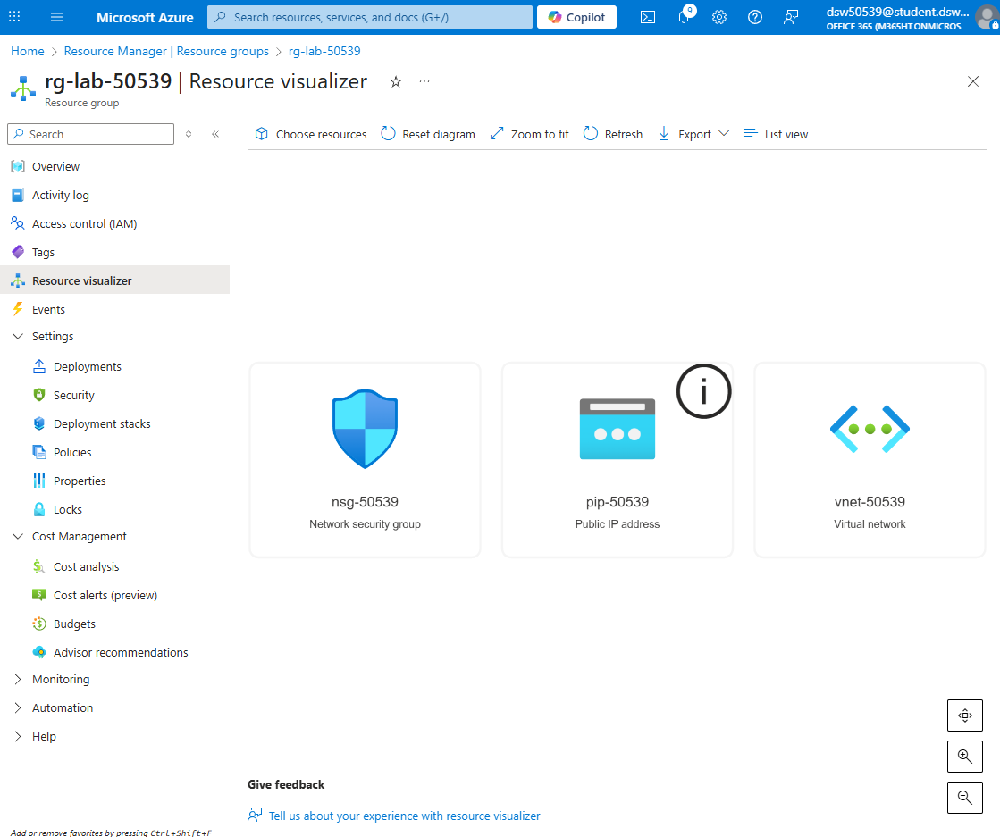

# Terraform Lab – Maszyna wirtualna w Azure

Ten folder zawiera kod Terraform, który tworzy kompletną infrastrukturę sieciową  
oraz maszynę wirtualną Linux (Ubuntu 22.04 LTS) w regionie France Central.  
Wszystkie nazwy zasobów zawierają numer indeksu studenta.

## Utworzone zasoby
- Resource Group  
- Virtual Network  
- Subnet  
- Public IP  
- Network Security Group (z regułą SSH)  
- Network Interface  
- Linux Virtual Machine  

## Architektura
